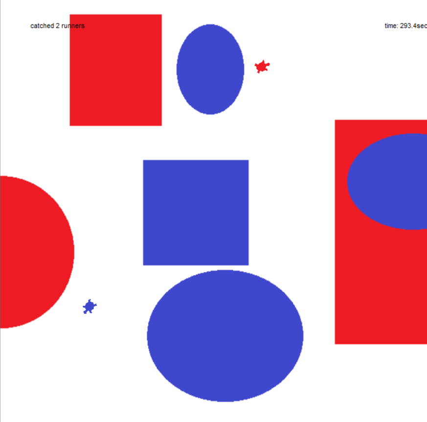

# Turtle Runaway

## Outline
**Turtle Runaway** is a top-down, 2D **chase/evade arcade** game.  
You (the **red** turtle, *chaser*) try to catch the **blue** turtle (*runner*) as many times as possible **before the timer reaches 0**.  
Each tick, the runner takes **one action** (turn **or** move) and tries to head **away from the chaser**. Near screen edges the runner **respawns** to a random position.

- Blue = runner (AI)
- Red = chaser (player)
- HUD: top-left = `catched N runners` (score), top-right = remaining time (sec)
- Background image: `./img/background.png` (PNG/GIF recommended). The background uses **camouflage/protective coloration** to **obscure the turtles** and raise visual difficulty.

---

## Features (matches current code)
- **Simple controls:** Arrow keys to move/turn the chaser.
- **Runner AI:** Per tick, randomly **turns or moves** in the direction opposite to the chaser.
- **Difficulty ramp:** On every catch, the runner’s `step_move` **and** `step_turn` each **increase by +2**.
- **Edge handling:**
  - **Runner:** if within **20 px** of any border → **random respawn** inside bounds.
  - **Chaser:** position is **clamped** each tick so it cannot cross the border.
- **Timer & game over:** Starts at **300.0 s** and decreases by **0.1 s per tick** (`ai_timer_msec = 100`).  
  When the timer reaches **0.0** (or lower): HUD updates, **“GAME OVER”** is shown, arrow-key controls are disabled, and the loop stops.
- **Camouflage background:** makes runner/chaser harder to spot (visual challenge).

---

## Requirements
- Python **3.9+** (tested on **3.11**)
- Standard library modules: `tkinter`, `turtle`, `random`, `math`
- (Optional) **Pillow** (`pip install pillow`) — only if you want to use **JPG** as a background via `ImageTk`

> `turtle`/`tkinter` can load **PNG/GIF** directly. **JPG** is not supported by default (`PhotoImage`) and will raise `TclError` unless you use Pillow.

---

## Run
```bash
# Recommended: run from a terminal / command prompt
python turtle_runaway.py
